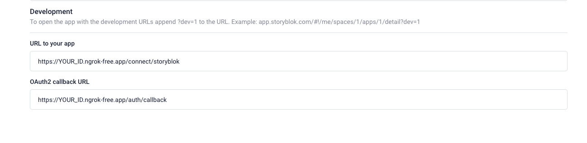
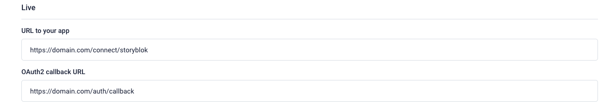

# Storyblok App Starter with Nuxt 3

## Prerequisites

- Refer to [README.md](../README.md) at the root of the repo.
- We recommend you look at the [Nuxt 3 documentation](https://nuxt.com/docs/getting-started/introduction), if you're not familiar with it.

## Setup

Make sure to install the dependencies:

```bash
npm install
```
___
## Local development

### Setup an SSL tunnel

We recommend you use [ngrok](https://ngrok.com/) to open a tunel to your development environment. In you terminal, execute:

```bash
$ ngrok http 3000 # the 3000 port is the Nuxt default
```

Use the urls you get from ngrok to fill out the following fields in the app settings area in Storyblok:

* `Url to your app` field: `https://YOUR_ID.ngrok-free.app/connect/storyblok`
* `Oauth2 callback url` field: `https://YOUR_ID.ngrok-free.app/auth/callback`



### Configure local environment variables

Finally, you must create configure the local development environment variables.

Copy [.env.example](./.env.example) and rename it to `.env`.
Then, configure all the variables listed.

Your credentials are available in the app settings area of Storyblok.

### Start the development server on `http://localhost:3000`

```bash
npm run dev
```

### Previewing the app

Visit the appropriate storyblok space and connect to your app.

Remember to set `?dev=1` as an url parameter to connect to the development version.

___
## Deploying to production

This app is like any other Nuxt app. Therefore, the deployment process is similar. 

Note that you'll have to configure the environment variables on your hosting provider.

```bash
CONFIDENTIAL_CLIENT_ID="Id from Storyblok App"
CONFIDENTIAL_CLIENT_SECRET="Secret from Storyblok App"
CONFIDENTIAL_CLIENT_REDIRECT_URI=https://domain.com/auth/callback
```

On top of that you'll also have to configure the application URL and redirect URL for your app on Storyblok.



Build the application for production:

```bash
npm run build
```

Locally preview production build:

```bash
npm run preview
```

Check out the [deployment documentation](https://nuxt.com/docs/getting-started/deployment) for more information.

